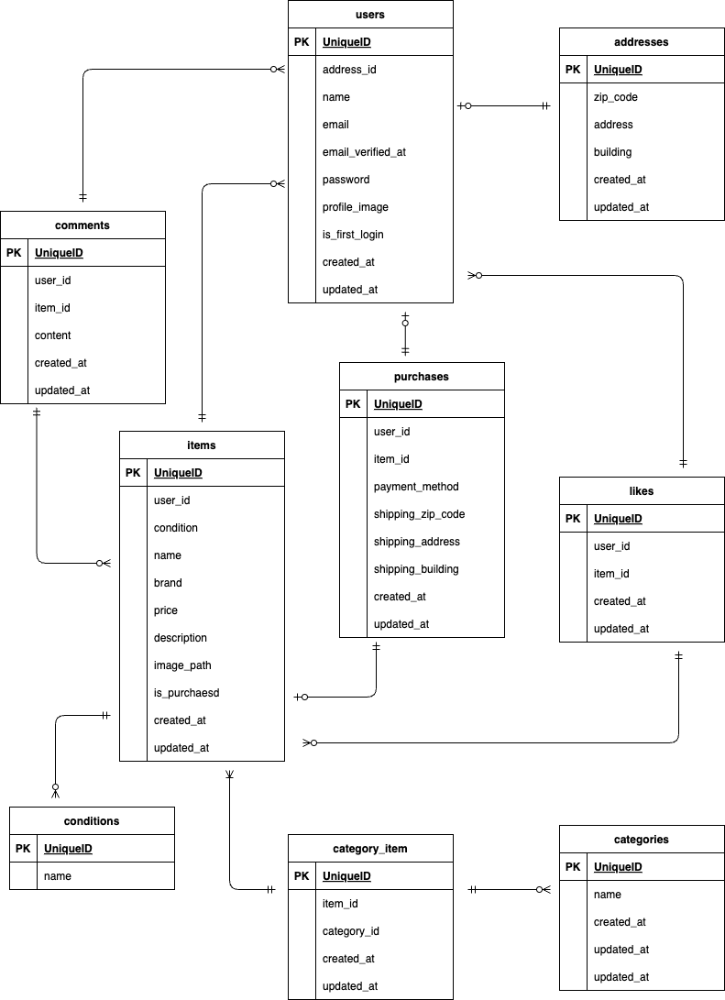

# coachtechフリマ（フリマサービス）

## 環境構築

1. `git clone git@github.com:kobasikibo/coachtech-flea-market.git`
2. DockerDesktopアプリを立ち上げる
3. `docker compose up -d --build`

**Laravel環境構築**
1. `docker compose exec php sh`
2. `composer -v`
3. `composer create-project --prefer-dist laravel/laravel .`
4. プロジェクトルートに「.env」ファイルを作成。
5. .envに以下の環境変数を追加
``` text
APP_NAME=Laravel
APP_ENV=local
APP_KEY=
APP_DEBUG=true
APP_TIMEZONE=UTC
APP_URL=http://localhost

APP_LOCALE=en
APP_FALLBACK_LOCALE=en
APP_FAKER_LOCALE=en_US

APP_MAINTENANCE_DRIVER=file
# APP_MAINTENANCE_STORE=database

BCRYPT_ROUNDS=12

LOG_CHANNEL=stack
LOG_STACK=single
LOG_DEPRECATIONS_CHANNEL=null
LOG_LEVEL=debug

DB_CONNECTION=mysql
DB_HOST=mysql
DB_PORT=3306
DB_DATABASE=laravel_db
DB_USERNAME=laravel_user
DB_PASSWORD=laravel_pass

SESSION_DRIVER=file
SESSION_LIFETIME=120
SESSION_ENCRYPT=false
SESSION_PATH=/
SESSION_DOMAIN=null

BROADCAST_CONNECTION=log
FILESYSTEM_DISK=local
QUEUE_CONNECTION=database

CACHE_DRIVER=file
CACHE_PREFIX=

MEMCACHED_HOST=127.0.0.1

REDIS_CLIENT=phpredis
REDIS_HOST=127.0.0.1
REDIS_PASSWORD=null
REDIS_PORT=6379

AWS_ACCESS_KEY_ID=
AWS_SECRET_ACCESS_KEY=
AWS_DEFAULT_REGION=us-east-1
AWS_BUCKET=
AWS_USE_PATH_STYLE_ENDPOINT=false

VITE_APP_NAME="${APP_NAME}"
```
6. アプリケーションキーの作成
``` sh
php artisan key:generate
```
7. マイグレーションとシーディングの実行
``` sh
php artisan migrate --seed
```

**Fortifyの設定**
1. `docker compose exec php sh`
2. `composer require laravel/fortify`

**Stripeの設定**
1. Stripeの公式サイト（https://stripe.com） にアクセス
2. 画面右上の「Sign up」ボタンをクリックして、アカウントを作成
3. Stripeダッシュボードにログイン後、左側メニューから「Developers」を選択し、「API keys」をクリック
4. 公開可能なキー（Publishable Key）とシークレットキー（Secret Key）をコピー
5. .envに以下の環境変数を追加（your-public-stripe-key-here と your-secret-stripe-key-here は実際のAPIキーを入力）
``` text
STRIPE_KEY=your-public-stripe-key-here
STRIPE_SECRET=your-secret-stripe-key-here
```

**Mailhogの設定**
1. Mailhogを使用するため、.envに以下の環境変数を追加
``` text
MAIL_MAILER=smtp
MAIL_HOST=mailhog
MAIL_PORT=1025
MAIL_USERNAME=null
MAIL_PASSWORD=null
MAIL_ENCRYPTION=null
MAIL_FROM_ADDRESS=noreply@example.com
MAIL_FROM_NAME="${APP_NAME}"
```

## 使用技術(実行環境)
- PHP8.3.11
- Laravel11.23.5
- MySQL9.1.0

## ER図


## URL
- 開発環境: http://localhost/
- phpMyAdmin: http://localhost:8081/
- MailhogのWebインターフェース: http://localhost:8025/
